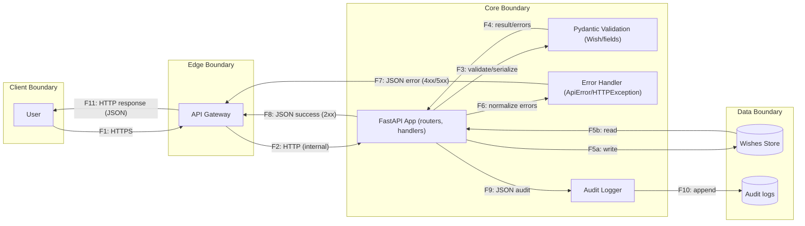

# DFD.md — Диаграмма потоков данных

```mermaid
flowchart LR
  %% ===== Trust Boundaries =====
  subgraph TB0["Client Boundary"]
    U["User"]
  end

  subgraph TB1["Edge Boundary"]
    GW[API Gateway]
  end

  subgraph TB2["Core Boundary"]
    A["FastAPI App (routers, handlers)"]
    V["Pydantic Validation (Wish/fields)"]
    E["Error Handler (ApiError/HTTPException)"]
    L["Audit Logger"]
  end

  subgraph TB3["Data Boundary"]
    D[("Wishes Store")]
    LG[("Audit logs")]
  end

  %% ===== Flows =====
  U  -- "F1: HTTPS" --> GW
  GW -- "F2: HTTP (internal)" --> A

  A  -- "F3: validate/serialize" --> V
  V  -- "F4: result/errors" --> A

  A  -- "F5a: write" --> D
  D  -- "F5b: read" --> A

  A  -- "F6: normalize errors" --> E
  E  -- "F7: JSON error (4xx/5xx)" --> GW
  A  -- "F8: JSON success (2xx)" --> GW

  A  -- "F9: JSON audit" --> L
  L  -- "F10: append" --> LG

  GW -- "F11: HTTP response (JSON)" --> U
```
